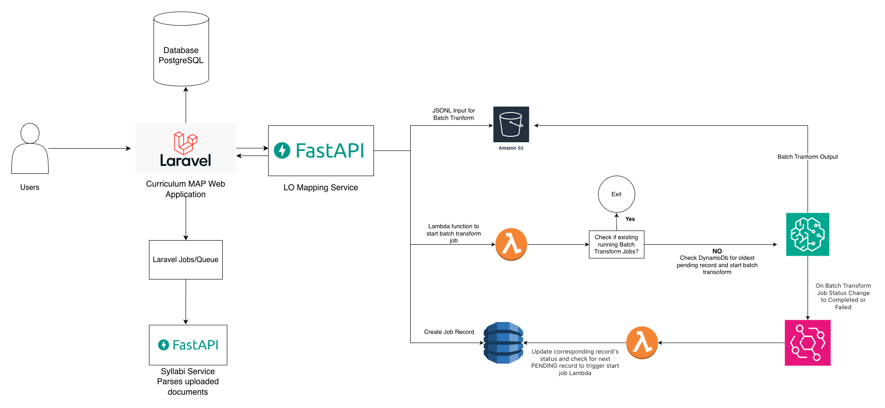

# High-Level Architecture

## Overview

This application is split into a primary Laravel web application and two Python services:

- `laravel/`: the main user interface of the Curriculum Mapping Tool with courses, programs, syllabi, persistence, permissions, and reporting
- `python/services/syllabi_service/`: a FastAPI service that parses uploaded syllabus files and extracts structured course data
- `python/services/lo_mapping_service/`: a FastAPI service that prepares and manages learning-outcome mapping via LLM (Qwen/Qwen3-8B) and post-processes the results

## Laravel Application

The Laravel application is the core platform. It is responsible for:

- authentication, authorization, and role-based access control
- course, program, syllabus, and outcome management
- admin tooling and dashboard workflows
- document generation and reporting
- queue-based background work
- persistence of entities in the relational database (PostgreSQL)

Important areas in the codebase include:

- `laravel/app/Http/Controllers/`: request handling and user workflows
- `laravel/app/Models/`: domain models such as courses, programs, outcomes, mappings, syllabi, and users
- `laravel/app/Jobs/`: background jobs, including syllabus-file processing
- `laravel/routes/web.php`: the main browser-facing routes

For a detailed explanation of how access control works in the tool, see [Role-Based Access Management](./role-based-access-management.md)

## Python Services

### Syllabi Service

`python/services/syllabi_service/` is a FastAPI application that exposes `POST /create_course_from_syllabi`.

Its responsibility is to take a syllabus file path plus the original filename, parse the document, and return structured course data such as:

- course code and number
- title, term, and year
- description
- learning outcomes
- assessment methods and weights

The parsing logic lives in `app/services/syllabus_parser.py` and uses document/text extraction libraries to convert uploaded syllabus files into structured JSON.

This service behaves as a processing service that returns extracted data back to the tool.

For service-specific notes, see [FastAPI Syllabi Service](./FastAPISyllabiService.md)

### Learning Outcome Mapping Service

`python/services/lo_mapping_service/` is a FastAPI application for asynchronous CLO-to-PLO or standards mapping.

Its responsibilities are to:

- accept mapping requests through `POST /map-program-outcomes`
- generate batch tranform input records from course outcomes, program outcomes, and mapping scales
- persist request state in DynamoDB with processing status
- store batch input/output references in S3
- invoke Lambda functions to start and monitor batch inference jobs
- post-process model output into structured mapping results
- send the final results to the tool HTTP endpoint configured by `LARAVEL_API_URL`

It also provides:

- `GET /health` for service health checks
- `POST /get-processed-results` for demand-based access to mappinf results
- `POST /process-batch-transform-results` to trigger result processing in the background (This would no longer be needed with scheduled and demand-based access of results)

For service-specific notes, see [FastAPI LO Mapping Service](./FastAPILOMappingService.md)

## How The Services Interact

### 1. Syllabus Import Flow

1. A user uploads a syllabus file to the tool.
2. Laravel tool stores metadata for the uploaded file in `CourseSyllabiFile`.
3. Laravel tool dispatches `ProcessCourseSyllabiFile`.
4. The job calls the Python syllabi service using `config('services.python_api.base_url')` and `POST /create_course_from_syllabi`.
5. The Python service parses the file and returns structured course information.
6. Laravel tool creates and persists the resulting `Course`, `CourseDescription`, `LearningOutcome`, `AssessmentMethod`, and ownership records.

In this flow, communication is synchronous HTTP from the Laravel queue job to FastAPI.

### 2. Learning Outcome Mapping Flow

1. User submits a mapping request in the Laravel Tool
2. A request is sent to Python `POST /map-program-outcomes` whose payload contains course id, program id, course outcomes, program outcomes, and mapping scales.
3. The service creates batch tranform input records and uploads them to S3.
4. It creates a DynamoDB request record with statuses such as `PENDING`, `IN_PROGRESS`, `AWAITING_COMPLETION`, or `AWAITING_COMPLETION_FAILED`.
5. A Lambda function starts the batch tranform job for the oldest job in `PENDING` status stored in DynamoDB if no job is running, otherwise does nothing.
6. When inference completes, eventbridge triggers the result-processing lambda function which updates the staus of corresponding job in DynamoDB and starts batch tranform job for the oldest record in DynamoDB in `PENDING` status
7. A scheduled job or demand-based request from Laravel tool runs `process_records` in FastAPI
8. The output is read from S3 and converted into structured mapping results such as `clo_id`, `plo_id`, `is_mapped`, `map_labels`, and `explanation`.
9. The mapping service sends those processed results to a Laravel endpoint defined by `LARAVEL_API_URL`.

The core backend functionality for the LO Mapping Service in Python service and UI changes needed to support learning outcome mapping in Laravel are largely complete. The remaining work is the final end-to-end testing of backend functionality and integration with Laravel.
